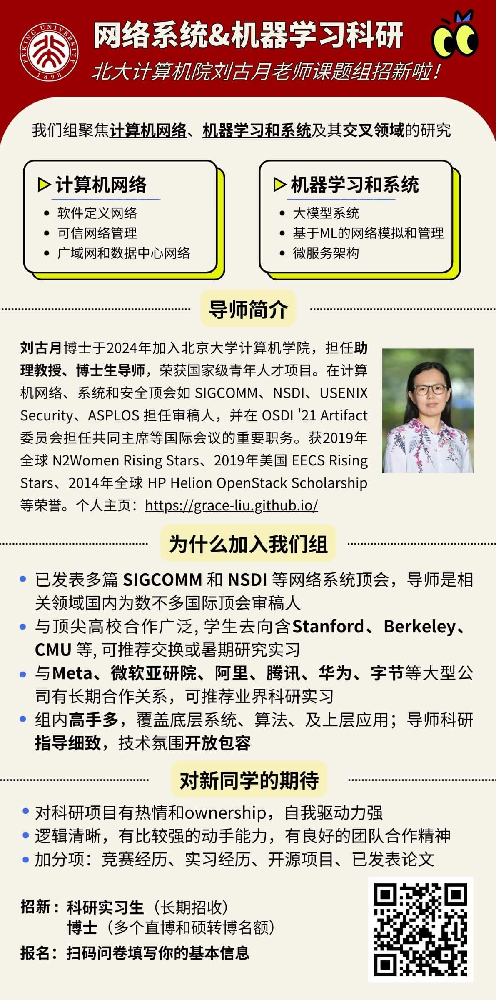

## 网络系统&机器学习科研机会 | 北大计算机院刘古月老师课题组招新啦

我们招新了！实验室主要研究方向为计算机网络和系统，有多个直博/硕转博名额，常年招收研究实习生。

## 导师简介
刘古月博士于2024年加入北京大学计算机学院，担任助理教授、博士生导师，荣获国家级青年人才项目。在计算机网络、系统和安全顶会如 SIGCOMM、NSDI、USENIX Security、ASPLOS担任审稿人，并在OSDI’21 Artifact 委员会担任共同主席等国际会议的重要职务。获2019年全球N2Women Rising Stars、2019年美国EECSRisingStars、2014年全球 HP Helion OpenStack Scholarship等荣誉。

个人主页：https://grace-liu.github.io/ 

## 研究方向
我们组聚焦**计算机网络**、**机器学习和系统**及其**交叉领域**的研究，具体包含以下方向：
1. **网络**：软件定义网络（SDN）、可信网络管理（Trustworthy Network Management）、广域网（WAN）和数据中心网络（DCN）
2. **机器学习和系统**: 大模型系统、基于机器学习的网络模拟和网络管理、微服务架构

## 为什么加入我们组？
### 研究成果和影响力
1. _成果质量_：我们组已发表多篇 SIGCOMM 和 NSDI 等计算机网络系统顶级学术会议，导师是国内相关领域为数不多的顶会审稿人。
2. _国际影响力_：我们和顶尖名校合作交流多，本组毕业的同学offer多多，本科生去向含Stanford、CMU、Berkeley 等, 可推荐交换或暑期研究实习。
3. _业界合作_：我们组与 Meta、微软亚研院、阿里、腾讯、华为、字节等公司的科研部门有广泛合作，可以为同学推荐实习和工作机会。

### 研究团队和氛围
1. _氛围开放包容_：定期会议讨论项目进展、互相分享领域内最新成果，鼓励每位同学探索自身的科技潜能
2. _研究指导细致_：我们期望培养每一个同学都成为具备独立能力和合作意识的研究者。从讨论idea、做实验到写文章，导师和组内同学会在不同科研阶段提供有针对性的指导和帮助，使同学逐步建立从发现、定义到解决问题的能力。
3. _背景丰富多样_：组内同学从底层系统到机器学习应用均有高手，亦有知名开源项目核心开发者；多数同学有海外交换或留学背景

## 对同学的期待
1. 沟通和逻辑思维能力：对科研项目有ownership，主动交流，用清晰的逻辑进行表达与沟通
2. 实践动手：我们的研究方向注重实现真实的原型系统，因此希望你有一定编程能力，不怯代码大胆动手尝试
3. 加分项：竞赛经历、实习经历、开源项目、已发表论文
4. 最最最重要的：对于科研的热情和兴趣，以及自我激励！

## 招生对象
- **博士**：组内有多个直博和硕转博名额，欢迎符合条件的同学联系；
- **实习生**：欢迎对研究方向感兴趣的各阶段本科生和硕士生联系，提供有竞争力的实习补助。

## 如何加入
如果你对加入我们有兴趣，通过问卷填写你的基本信息：https://wj.qq.com/s2/14290061/5033/

